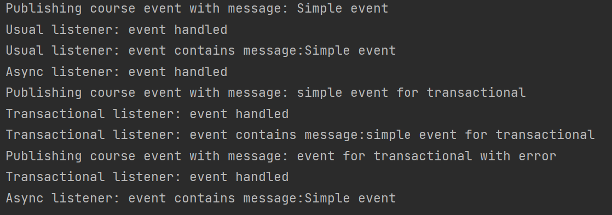

# java_skbCourse_hw5
## Event listener
## Демонстрация работы

### P.S
Usual listener, и Async listener ловят Simple event. Только Async listener выводит текст события через одну секунду. Transactional listener ловит два события с ошибкой и без неё, если текст события содержит "error", то вызывается RuntimeException и текст события не печатается.

## Запуск
1. Укажите данные от базы данных postgres в `application.properties`
2. Выполните следующие команды:
`mvn package`
`mvn spring-boot:run`